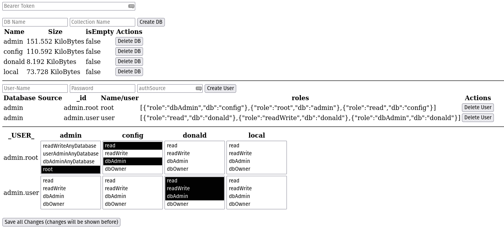

This Project is a very, very simple PHP API for managing users (+ permissions) + databases in MongoDB

## Features
- Create + Delete Databases
- Create + Delete Users
- Grant + Revoke Roles for users on databases





### Usage

```yaml
services:
  mongo-mgnt:
    image: n404/php-mongodb-management
    ports:
      - 8777:8080
    environment:
      - DB_HOST=172.17.0.1
```

### Configuration with environment variables
| ENV                                     | Value     |
|-----------------------------------------|-----------|
| DB_HOST                                 | localhost |
| DB_PORT                                 | 27017     |
| DB_USER                                 | root      | 
| DB_PASSWORD                             | example   | 
| DB_USER_AUTH_SOURCE (for DB_USER!)      | admin     | 
| AUTH_TOKEN (if empty, auth is disabled) | ""        | 

#### Authentication

If you need authentication for the API, simply set the `AUTH_TOKEN` environment variable to any string and specify this string on the index.html file or at the HTTP API requests in the `Authorization` HTTP Header as an `Bearer` token like this: `Authorization: Bearer <token>`.


The source code currently is a bit crazy, but working.

HTTP API Documentation with OpenAPI schema coming soon in the future or so. (Currently, check the developer tools of the browser).

&copy; 2024 Trickfilm400